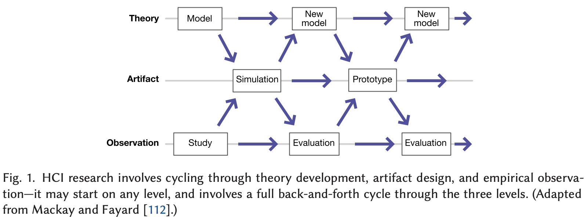

# Technical HCI Research

The following text is mainly based on the following chapter:

```
Hudson, S.E. and Mankoff, J., 2014. Concepts, values, and methods for technical human–computer 
interaction research. In Ways of Knowing in HCI (pp. 69-93). New York, NY: Springer New York.
```

## What is technical HCI & why are we talking about it
In one sentence---
> ... the fundamental activity of technical HCI is one of invention—we seek to use technology to expand what can be done or to find how best to do things that can already be done.

Does it sound like what you've been doing in your research? Perhaps you've been too busy with *doing* the research to *think* about it.

Sometimes it is valuable to take a step back from conducting specific research projects and take a good look at your entire research program at arm's length, asking yourself, "What is that I am researching on?"

Pragmatically, such a reflection helps you define and differentiate yourself amongst the large varieties of research in HCI, which is critical when competing for job offers, awards, and grants.


## Discovery vs. Invention
To understand how technical HCI fits the vastness of the HCI world, we can refer to this minimalistic dichotomy.

First, there is discovery research---
> ... parts of HCI that aim to describe or understand the world through, for example, new discoveries about how the world works, critical theory, or models of human behavior.

Then, there is inventive research, as highlighted in the definition quoted at the beginning.

A narrower view to contrast this two approaches would be discovery research focuses on studying how technology works while inventive research on creating new technology.

Of course, this dichotomy doesn't mean to classify any given HCI research into binary buckets; rather, one should think of discovery vs. invention as two directions on a spectrum.
Quite a lot of HCI research, for example, is mainly about inventing new interaction techniques while also benefiting from a discovery of users' needs or their feedback after experiencing the techniques.


In any domain, invention is always about creating innovative things. 
To conduct inventive, technical HCI research, there are two general challenges, which we briefly discuss below.


## Challenge \#1: how to come up with innovative ideas?
Hudson and Mankoff's chapter didn't really answer this question; rather, their take is that it doesn't really matter how---

> ... for activities of invention, the use of one method versus another is much more fluid and less fundamental.

> It might be that the inventors came up with their result by means of an arduous process of testing many alternatives, or it might be that the concept came to them in a dream the night before. However, if both paths lead to the same invention, it is equally good.

Perhaps what the text above implies is that there shouldn't be a prescribed method for inventive HCI research and one can take whatever approach that works for them as long as it leads to innovative ideas.

In contrast, there is a different perspective that systematizes HCI's process of creating artifacts (e.g., novel techniques or systems).
For example, [Mackay and Fayard](https://dl.acm.org/doi/abs/10.1145/263552.263612) consider this process an interplay amongst theory development, artifact design, and empirical observation. 
In other words, one can scaffold the ideation process with relevant theory and back it up with empirical evidence.

The figure below comes from Michel Beaudouin-Lafon's [paper](https://dl.acm.org/doi/full/10.1145/3468505).



## Challenge \#2: how to realize an innovative idea?
There might be a misconception that HCI invention will result in an actual product, like what a tech start-up company does.
In reality, it is both infeasible and unwise to pursue such an engineering-centric effort.

It is infeasible because if an idea is truly innovative, it probably requires implementation solutions that don't already exist (otherwise somebody else might have already used such solutions to implement similar ideas).

Even if there is a clear path of implementation, engineering a full-fledged product often goes beyond the resources affordable in a research team.
Therefore, it is unwise to keep searching for the perfect implementation solutions, which blocks the truly innovative part of the work.

Instead, one strategy is to employ some non-perfect solutionsto partially implement or approximate the ideal version of the idea.
For example, in this [project](https://hci.ucla.edu/#projects-around-body-interaction), the innovative idea is that our smartphone can become aware of its 3D position relative to the user's body to enable a new class of interaction techniques. 
While the perfect way of implementing this idea wasn't available, we approximated it using the phone's inertial sensor and front camera to coarsely estimate its around-body position.

Sometimes the implementation solution doesn't exist but its components do.
In such cases, we often need to put together a complex system using building blocks from various domains (e.g., computer vision, natural language processing, and machine learning).

> Normally we invent by combining a set of things we already understand how to create into larger, more complex, or more capable things that did not previously exist.

Sometimes there is a misconception that a system is not innovative because each of its components isn't new. It's important to stress that the innovative aspect comes from the system as a whole that realizes/approximates an innovative HCI idea. 
Additionally, innovation can be designing an way (architecture) to purposefully put together the already-existing components, which goes beyond the existing knowledge about each individual component alone.

## Final words
Technical HCI research focuses on inventing innovative ideas of interactive technology, which contrasts discovery HCI research that employs rigorous methods to understand existing interactive technology.
To succeed in conducting technical HCI research, one must develop methods to come up with innovative ideas (with support from theory and empirical studies) and employing the appropriate implementation solutions to realize or approximate an idea.